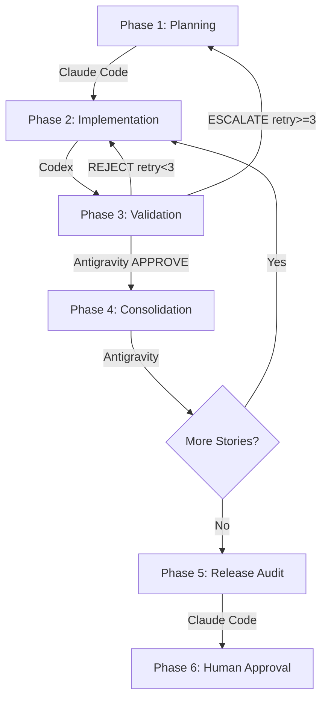

# Triad.ai - Foundation Specification

## 1. Project Vision (The "Why")
**triad.ai** is a **Multi-Agent Orchestration Framework** designed for developers who want to scale software engineering through isolated AI roles.

The project solves the "AI Context Collapse" problem by enforcing:
1. **Strict Role Separation** (Claude plans, Codex implements, Antigravity validates).
2. **Document-Based Shared Memory** (The `CONTEXT_STATE.md` token).
3. **Mandatory Human Control** (Final commit approval).

## 2. Core Principles

### Role Isolation
Each agent operates within strict boundaries defined in `prompts/`. STOP rules at the top of each prompt explicitly declare what the agent MUST NOT do. No agent may perform actions assigned to another agent.

### File-Based Communication
Agents do not communicate directly. All inter-agent communication happens through shared markdown files (`CONTEXT_STATE.md`, `roadmap.md`, `architecture.md`, `CHANGELOG.md`, `AGENTS.md`, `progress.txt`). This ensures transparency and version control compatibility.

### Multi-Skill Library
Skills are organized into 4 directories (`shared/`, `claude_code/`, `codex/`, `antigravity/`) with 3 priority tiers (P0 compact, P1 standard, P2 extended). Each skill follows the format in `skills/SKILL_FORMAT.md`. See `skills/GLOBAL_SKILLS.md` for the index.

### Strategic Alignment
All work must align with the `TRIAD_MASTER_ROADMAP.md`, which defines 19 Phase 2 pillars for competitive parity and Phase 3 strategic differentiation goals. Agents read this file as part of their mandatory initialization sequence.

## 3. The 5-Phase Pipeline
Every feature travels through this state machine:

For detailed lifecycle documentation, see [ORCHESTRATION_GUIDE.md](ORCHESTRATION_GUIDE.md).

## 4. Rejection and Escalation Protocol

Antigravity's decisions are **binary**: APPROVE or REJECT. No conditional approvals.

- **Retry < 3:** Structured rejection → back to Codex with category, files, error, fix, checklist failures
- **Retry >= 3:** Escalation → back to Claude Code for re-architecture
- **Rejection Categories:** `TEST_FAILURE`, `SECURITY_VIOLATION`, `UX_VIOLATION`, `PILLAR_CONFLICT`, `PR_SIZE_EXCEEDED`

See `skills/antigravity/rejection-protocol.md` for the full protocol.

## 5. The Triad CLI (Command Line Interface)
The CLI tool at `scripts/triad-cli` provides the following commands:

| Command | Description |
|---------|-------------|
| `triad init` | Scaffolds `.agent/`, `docs/`, `prompts/`, `skills/`, and `templates/` directories |
| `triad run` | Reads `CONTEXT_STATE.md` and outputs current phase and assignee |
| `triad validate` | Triggers local linters and test suites (verifies VALIDATION phase) |
| `triad roadmap` | Displays Master Roadmap pillar status |
| `triad status` | Combined view of pipeline state and roadmap progress |
| `triad skills [agent]` | Lists loaded skills per agent with priority tier |
| `triad reject <category> <msg>` | Formats structured rejection and updates CONTEXT_STATE.md |
| `triad consolidate` | Reviews AGENTS.md for patterns worth promoting to skills |
| `triad --help` | Displays help information |
| `triad --version` | Displays CLI version |

## 6. Required Example (`examples/minimal-project`)
A fully working example (Node.js/Express) is provided to demonstrate:
- Pre-filled `roadmap.md` with tasks.
- A functional `architecture.md`.
- A failing test to demonstrate Antigravity's rejection loop to Codex.
- The `Roadmap Pillar(s)` field in `CONTEXT_STATE.md`.

---

> **Note for Contributors:** The Foundation phase DOES NOT include UI dashboards, advanced persistent memory databases, or multi-LLM routing backends. Those belong to Phase 2 (see `TRIAD_MASTER_ROADMAP.md`).
