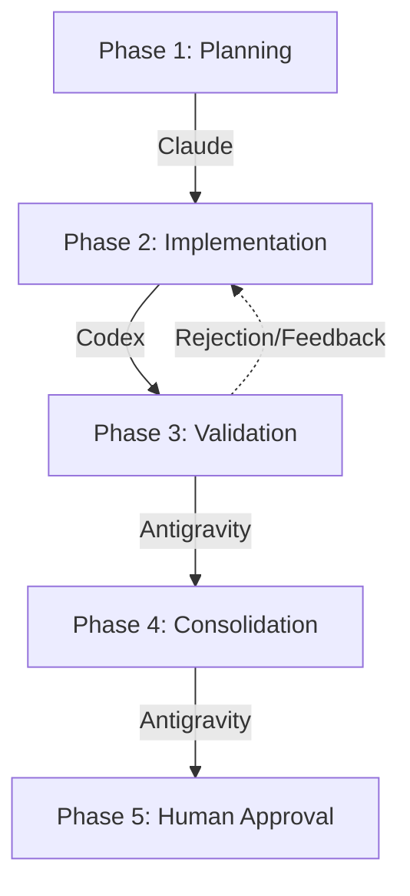

# Triad.ai - Foundation Specification & Architecture

## 1. Project Vision (The "Why")
**triad.ai** is not just an agent prompt; it is a **Multi-Agent Orchestration Framework** designed for developers who want to scale software engineering through isolated AI roles.

The project solves the "AI Context Collapse" problem by enforcing:
1. **Strict Role Separation** (Claude plans, Codex implements, Antigravity validates).
2. **Document-Based Shared Memory** (The `CONTEXT_STATE.md` token).
3. **Mandatory Human Control** (Final commit approval).

## 2. The 5-Phase Pipeline
Every feature in `triad.ai` travels through this state machine:

## 3. The Triad CLI (Command Line Interface)
To lower the barrier to entry, `triad.ai` provides a minimal CLI tool located in `scripts/triad-cli`. 

### Key Commands:
- `triad init`: Scaffolds the `.agent/`, `docs/`, and `skills/` directories in a new project.
- `triad run`: Reads the current `CONTEXT_STATE.md` and outputs who is supposed to be working.
- `triad validate`: Manually triggers the Antigravity local linters and test suites.

## 4. Required Example (`examples/minimal-project`)
To guarantee adoption, a fully working example (Node.js/Express) is provided. This example contains:
- Pre-filled `roadmap.md` with tasks.
- A functional `architecture.md`.
- A failing test to demonstrate Antigravity's rejection loop to Codex.

---

> **Note for Contributors:** The Foundation phase DOES NOT include UI dashboards, advanced persistent memory databases, or multi-LLM routing backends. Those belong to v2.0.
